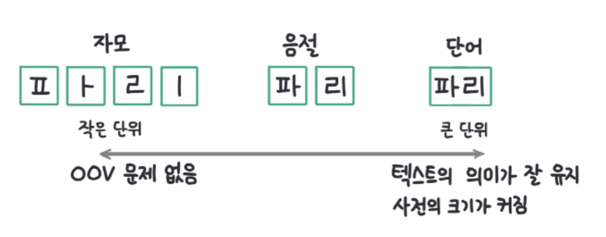

# transformer-study
트랜스포머의 기초와 구조를 공부하기 위해 만들어진 프로젝트입니다.

---
### 트랜스포머 아키텍처 기본 구조

* 임베딩 층 : 데이터의 의미를 컴퓨터가 이해할 수 있도록 숫자의 집합으로 표현한 것.
  * 1단계 토큰화
    * 토큰화는 텍스트를 적절한 단위로 잘라 아이디를 부여하는 것임.
    * 토큰화는 단위가 작을수록 텍스트의 의미가 사라진다는 문제가 있고, 단위가 클수록 의미가 잘 유지되지만 사전에 없는 단어 (OOV)문제가 발생할 수 있음.
    * 
  * 2단계 토큰 임베딩으로 변환
    * 토큰화에서 부여한 토큰 아이디는 하나의 숫자 집합일 뿐 토큰의 의미를 담을 수 없음.
    * 의미를 담기 위해선 최소 두 개 이상의 숫자 집합인 벡터여야 함.
* 위치 인코딩 층: 문장의 위치 정보를 더함
  * 트랜스포머는 모든 입력을 동시에 처리하기 때문에 순서 정보가 사라짐
  * 순서는 매우 중요한 정보이기 때문에 위치 정보를 추가하는 것.
* 인코더: 언어를 이해하는 역할
* 디코더: 언어를 생성하는 역할