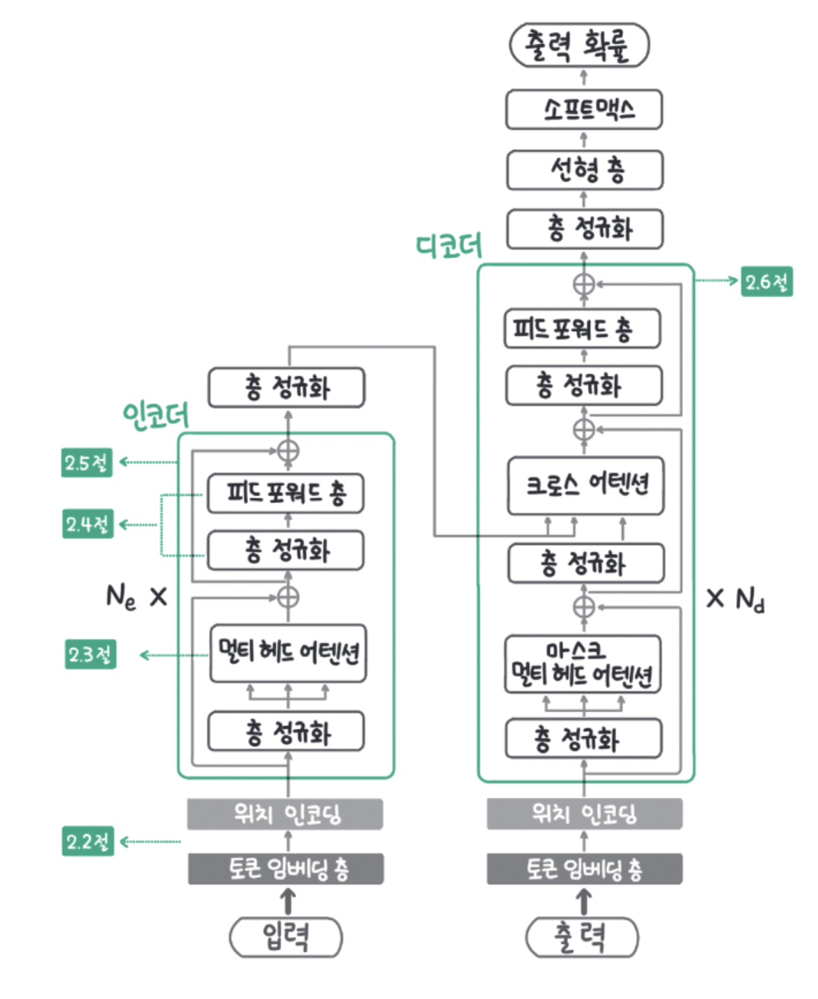

# 트랜스포머 아키텍처 완전 기초부터 자세히 이해하기

> 이 문서는 트랜스포머(Transformer) 아키텍처에 대해 초보자도 이해할 수 있도록 아주 상세하고 친절하게 설명합니다.

## 1. 트랜스포머란 무엇인가요?

트랜스포머는 2017년 구글의 논문 "Attention is All You Need"에서 처음 소개된 딥러닝 모델입니다. 주로 자연어 처리(NLP)에서 사용되며, 번역, 요약, 질의응답, 텍스트 생성 등 다양한 작업에 활용됩니다.

기존 RNN이나 LSTM은 입력을 순차적으로 처리하지만, 트랜스포머는 **입력 전체를 동시에(병렬로)** 처리할 수 있어서 학습 속도가 빠르고 성능도 뛰어납니다.

---

## 2. 전체 구조 한눈에 보기

트랜스포머는 크게 두 부분으로 나뉩니다:


- **인코더(Encoder)**: 입력 문장을 처리해서 의미를 추출함
- **디코더(Decoder)**: 추출된 의미를 바탕으로 출력 문장을 생성함

각각의 인코더와 디코더는 여러 층(layer)으로 구성되어 있으며, 각 층은 같은 구조를 반복합니다.

```
[Input] -> [Encoder Layer 1] -> ... -> [Encoder Layer N]
                                   |
                                   V
                           [Decoder Layer 1] -> ... -> [Decoder Layer N] -> [Output]
```

---

## 3. 입력을 어떻게 처리하나요?

트랜스포머는 문장을 숫자로 바꿔서 처리합니다. 이 과정을 거칩니다:

1. **토크나이징(Tokenizing)**: 문장을 단어 또는 서브워드 단위로 자릅니다.
2. **임베딩(Embedding)**: 각 토큰을 고정된 차원의 벡터로 변환합니다.
3. **포지셔널 인코딩(Positional Encoding)**: 순서를 알 수 있도록 위치 정보를 더해줍니다.

> 트랜스포머는 순서를 직접 처리하지 않기 때문에, 위치 정보를 명시적으로 추가해줘야 합니다.

---

## 4. 인코더와 디코더 내부는 어떻게 생겼나요?

### 4.1 인코더(Encoder) 구조

인코더의 각 층은 다음 구성요소로 이루어집니다:

1. **멀티-헤드 셀프 어텐션(Multi-Head Self-Attention)**
2. **피드포워드 신경망(Feed-Forward Neural Network)**
3. **잔차 연결과 정규화(Residual Connection + LayerNorm)**

각 구성 요소는 다음과 같이 작동합니다:

#### 멀티-헤드 셀프 어텐션
- 문장의 각 단어가 다른 단어를 얼마나 중요하게 생각하는지를 계산합니다.
- 여러 개의 어텐션 헤드로 다양한 관계를 병렬로 학습합니다.

#### 피드포워드 신경망
- 각 단어 벡터에 독립적으로 2층 신경망을 적용합니다.

#### 잔차 연결과 정규화
- 각 층의 출력에 입력을 더해주는 잔차 연결(skip connection)을 적용하고, 정규화합니다.

---

### 4.2 디코더(Decoder) 구조

디코더는 인코더보다 살짝 더 복잡합니다. 각 층은 다음을 포함합니다:

1. **마스크드 멀티-헤드 셀프 어텐션(Masked Multi-Head Self-Attention)**
2. **인코더-디코더 어텐션(Encoder-Decoder Attention)**
3. **피드포워드 신경망**
4. **잔차 연결과 정규화**

> 마스크드 어텐션은 미래의 단어를 보지 않도록 막아주는 역할을 합니다.

---

## 5. 어텐션 메커니즘 자세히 보기

어텐션은 다음 세 가지 벡터를 사용합니다:

- **Query (Q)**: 현재 단어가 무엇을 찾고 싶은지
- **Key (K)**: 다른 단어가 어떤 정보를 가지고 있는지
- **Value (V)**: 실제 정보 자체

어텐션 점수는 다음 수식으로 계산합니다:

```
Attention(Q, K, V) = softmax(QK^T / sqrt(d_k)) * V
```

- Q와 K의 내적을 통해 연관성 점수를 계산합니다.
- 이 점수에 softmax를 취해서 확률처럼 만듭니다.
- 확률을 V에 곱해서 최종 정보를 얻게 됩니다.

멀티-헤드는 이 과정을 여러 번 병렬로 수행한 것입니다.

---

## 6. 포지셔널 인코딩이란?

트랜스포머는 입력 순서를 모르기 때문에, **포지셔널 인코딩(Positional Encoding)**을 추가합니다.

보통 사인(sin)과 코사인(cos) 함수를 이용한 고정된 방식으로 만듭니다:

```
PE(pos, 2i)   = sin(pos / 10000^(2i/d_model))
PE(pos, 2i+1) = cos(pos / 10000^(2i/d_model))
```

이렇게 하면 위치 간의 상대적인 거리를 벡터에서 구분할 수 있습니다.

---

## 7. 트랜스포머의 장점

- 병렬처리 가능 → 훈련 속도 빠름
- 긴 문장도 잘 처리함
- 번역, 요약, 생성 등 다양한 작업에 성능이 뛰어남

---

## 8. 트랜스포머 이후의 발전들

트랜스포머는 다양한 파생 모델의 기반이 됩니다:

- **BERT**: 인코더만 사용
- **GPT**: 디코더만 사용
- **T5**: 인코더-디코더 구조 전체 사용
- **Vision Transformer**: 이미지 처리에 응용

---

## 마무리

트랜스포머는 처음엔 복잡하게 느껴질 수 있지만, 구조를 하나하나 뜯어보면 논리적으로 매우 잘 설계된 모델입니다. 핵심은 "어텐션을 통해 모든 입력 간 관계를 다 볼 수 있다"는 점입니다. 위 구조를 잘 이해하고 있으면 다양한 트랜스포머 기반 모델도 쉽게 따라갈 수 있습니다.

> 다음 단계에서는 실제 트랜스포머 코드 구현이나 Hugging Face 모델 활용법으로 이어지면 좋습니다!

