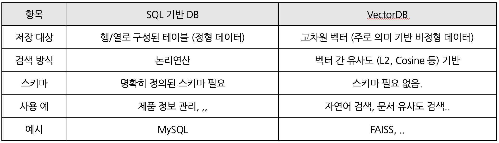
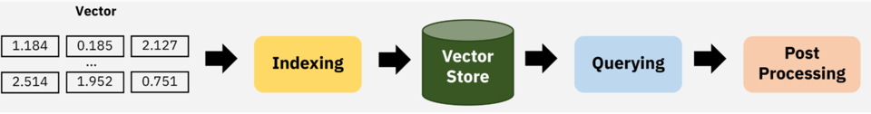
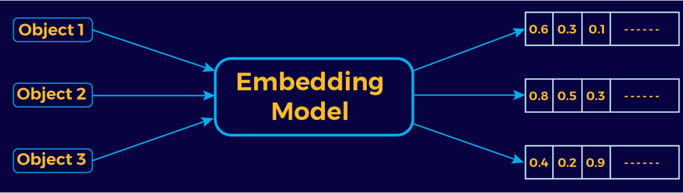

## VectorDB

### VectorDB란?
* Vector
  * 원래 의미 (수학): 벡터는 크기와 방향을 동시에 가지는 수학적 객체 (화살표)
  * AI에서의 의미: 벡터는 숫자들의 나열
* DB
  * 
* VectorDB
  * 임베딩을 통해 생성된 고차원의 벡터 데이터들을 효율적으로 저장하고, 조회할 수 있도록 설계된 데이터베이스
  * 벡터간의 거리나 유사도를 기반으로 쿼리와 가장 유사한 벡터를 찾음.

## VectorDB Process

* Embedding
  * 입력을 숫자 벡터를 바꾼 것
  * 이 숫자 벡터는 의미를 담고 있음.
  * 비슷한 의미의 문장은 벡터 값도 비슷하게 나옴.
* Indexing
  * 수많은 벡터들을 효율적으로 검색할 수 있도록 DB에 넣는 과정
  * 그냥 넣는 것이 아니라, 검색이 빠르도록 최적화된 구조로 저장함.
* Vector Store
  * 벡터들이 저장되어 있는 데이터 베이스
  * 여기서 유사한 벡터들을 빠르게 검색함.
* Querying
  * 질문하고 유사 벡터 찾기.
  * 사용자가 질문하면, 그 질문도 벡터로 변환한 다음 
  * 벡터 저장소에 있는 벡터들과 비교해 유사한 벡터를 찾아줌.
  * 유사한 벡터를 찾는 방식은 Indexing 알고리즘에 따라 달라짐 (Cosine Similarity, L2, Dot Product)
* Postprocessing
  * 검색된 결과를 필요한 형식으로 정리하는 등 후처리

## VectorDB 왜씀?
* 기존 키워드 기반 검색은 "정확히 일치" 해야 찾을 수 있음.
* AI 가 뭐야? , 인공지능이란?
  * 이 두개는 전혀 다른 문장으로 인식됨.
* VectorDB는 의미 기반으로 검색하여 유사한 문장을 찾아줌.

## 이 고차원 벡터는 도대체 어떻게 만들어지는 걸까?
* Embedding 모델이 이 역할을 해줌.
  * BERT, MiniLM, SentenceTransformer
  * 텍스트나 이미지를 벡터(숫자 배열)로 변환
  * 이 벡터는 단순한 숫자 나열이 아니라, 그 문장의 의미를 최대한 담도록 훈련된 결과임.

## 그럼 어떻게 검색하는 걸까
* 사용자 쿼리도 벡터로 변환
* 저장된 벡터들과 비교
  * 벡터간 유사도를 계산해서 비교함
    * L2거리, 코사인 유사도, 내적 등...
    * 가장 가까운 벡터들을 찾아서 그에 해당하는 문장이나 이미지, 문서를 사용자에게 결과로 반환하는 구조

## 예제 코드
* 파이썬 예제 (FAISS + SentenceTransformer)
* FAISS
  * 페이스북 AI 연구팀이 만든 대규모 벡터들을 빠르고 효율적으로 검색하기 위한 오픈 소스 라이브러리
  * 인덱싱 종류
    * IndexFlat
      * 벡터들을 그대로 저장
      * 쿼리 벡터와 모든 벡터를 하나하나 비교
      * 가장 정확하지만, 속도가 느리고 메모리 사용량이 많음.
      * <code>index = faiss.IndexFlatL2(dim)</code>
    * IndexIVF (Inverted File Index)
      * 전체 벡터를 k개의 클러스터로 나눔 (k-means)
      * 쿼리 벡터가 가장 가까운 클러스터 몇 개만 탐색
        * 전체 비교보다 훨씬 빠름
      * <code>quantizer = faiss.IndexFlatL2(dim)</code>
      * <code>index = faiss.IndexIVFFlat(quantizer, d, nlist)</code>
    * HNSW
      * 그래프 탐색 구조로 유사 벡터를 빠르게 찾음
      * 정확도도 높고 속도도 빠름.
      * 이웃노드끼리 연결하는 구조
      * <code>index = faiss.IndexHNSWFlat(d, M)</code>
* SentenceTransformer
  * 문장을 벡터로 바꿔주는 임베딩 모델

## VectorDB 성능의 핵심 요소
* 임베딩 품질
  * 얼마나 잘 의미를 포함해서 임베딩하느냐
* 인덱싱 구조, 검색 최적화
  * 유사 벡터를 찾는 효율성 (시간)
  * 유사 벡터를 비교하는 방삭

  

  